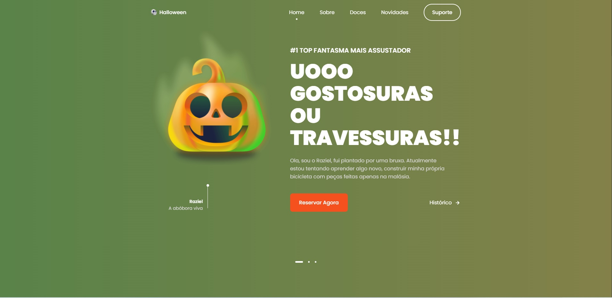

# Responsive Halloween Website 🎃

 <h3 align="center">
  It's halloween night
</h3>
<br><br>
<p align="center">
  <a href="#-about-the-project">About the project</a> •
  <a href="#-technologies">Technologies</a> •
  <a href="#-getting-started">Getting started</a> •
  <a href="#-license">License</a>
</p>

<p align="center">
  
</p>
 
 
  
## 👩‍💻 About the project

- Responsive Halloween Website Using HTML, CSS & JavaScript.
- Developed with two libs for an amazing designer.
- Contains animations when scrolling.
- Smooth scrolling in each section.
- Developed first with the Mobile First methodology, then for desktop.

[click here, see closer](https://ghost-agency.vercel.app/) 😉

## 🚀 Technologies

- HTML5 & CCS3
- [Swiper](https://swiperjs.com/)
- [ScrollrevealJs](https://scrollrevealjs.org/)

## 💻 Getting started

### Requirements

- [Node.js](https://nodejs.org/en/)
- [Yarn](https://classic.yarnpkg.com/) or [NPM](https://www.npmjs.com/) _(examples are with yarn)_

**Clone the project and access the folder**

```bash
$ git clone https://github.com/leandrorodrigues00/ghost--agency && cd ghost--agency

```

**Follow the steps below**

```bash
# Install the dependencies
$ yarn

# Make a copy of '.env.example' to '.env'
# and set with YOUR environment variables.
$ cp .env.example .env

# Start the app
$ yarn dev

# Navigate to http://localhost:3000
# The app will automatically reload if you change any of the source files.
```

## 📝 License

This project is licensed under the MIT License - see the [LICENSE](LICENSE) file for details.

---

<p align="center">
  Made with 💜&nbsp; by  Leandro Rodrigues
</p>
